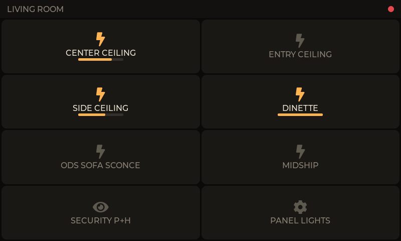
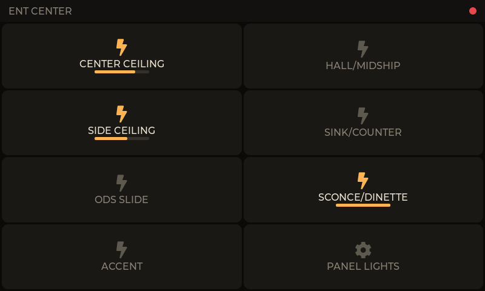

# firefly-touch

[](https://github.com/gauthig/firefly-touch/actions/workflows/build.yml)
[](LICENSE)

Replacement **touchscreen wall panels** for a 2019 Entegra Aspire 44W with a
Firefly Integrations **G6A multiplex system**.

The coach's factory switch panels are fixed-function membrane switches. This
project replaces them with 4.3" capacitive touchscreens that speak the coach's
native **RV-C** protocol directly on the CAN bus — no hub, no gateway, no
cloud. Each panel is an **independent peer node**: it transmits light commands
and listens for status frames, so it stays in sync with the factory switches
and the Firefly app automatically.

|  |  |
|---|---|
|  |  |
| **`mid_coach`** — replaces Entegra SW2-E8 | **`ent_center`** — replaces Entegra SW4-E1 |

*Screenshots from the built-in PC simulator (`sim/`) showing real UI code —
amber icon = load on, bar = brightness level from the bus.*

## How it works

- **Status-driven UI.** A button lights up only when a `DC_DIMMER_STATUS_3`
  frame from the bus says the load is on — never because you pressed it. Flip
  a factory switch and this panel updates; press here and the factory panel's
  LED updates. No master, no polling.
- **Tap to toggle, press-and-hold to dim.** Holding sends RV-C ramp commands
  while held and a stop on release.
- **Multi-instance buttons.** One button can drive several RV-C instances
  (e.g. SIDE CEILING = 30 + 31); it shows ON if any member is on and sends
  explicit on/off to all members so they can't drift out of sync.
- **Runs on the bus at night.** Dark theme, 5-minute idle auto-dim, and the
  touch that wakes the screen doesn't trigger the button underneath.

## Hardware

| Item | Detail |
|---|---|
| Board | Waveshare **ESP32-S3-Touch-LCD-4.3B** |
| MCU | ESP32-S3-WROOM-1-N16R8 (16 MB flash, 8 MB octal PSRAM) |
| Display | 4.3" 800×480 RGB565 parallel LCD |
| Touch | GT911 capacitive, I²C |
| Expander | CH422G (LCD/touch reset, backlight enable) |
| CAN | Onboard TJA1051 transceiver |
| Power | 7–36 V input (coach 12 V rail) |
| Bus | RV-C — CAN 2.0B, 250 kbps, 29-bit extended IDs |

> ⚠️ **Before first flash on a live coach:** the TWAI (CAN) TX/RX GPIO
> assignments are **not yet verified** against the 4.3B schematic. See
> [Open hardware TODOs](CLAUDE.md#open-pinprotocol-todos). Wrong pins can
> disturb the coach's RV-C bus.

## Repository layout

```
firefly-touch/
├── main/                     # app entry, tasks, UI screen
│   ├── main.c                #   task creation + core pinning
│   ├── twai_tasks.c          #   RV-C bus RX/TX tasks
│   ├── state_manager.c       #   instance→state table, owns truth
│   └── ui/ui.c               #   panel screen: status bar + button grid
├── components/
│   ├── rvc_protocol/         # RV-C encode/decode (pure C, host-testable)
│   │   └── host_test/        #   unit tests, run on your PC
│   ├── board_4_3b/           # Waveshare bring-up: RGB, CH422G, GT911, TWAI
│   └── ui_common/            # theme + shared dimmer-button widget
├── panels/                   # ← per-panel config, selected at build time
│   ├── REGISTRY.md           #   canonical index → source-address allocation
│   ├── TEMPLATE.h            #   copy this to add a panel
│   ├── mid_coach.h
│   └── ent_center.h
├── tools/check_panels.py     # enforces unique indices + registry sync
├── sim/                      # PC simulator (see the UI without hardware)
├── docs/                     # flashing guide, images
├── .github/workflows/        # CI/CD: lint, host tests, builds every panel,
│                             #   releases firmware zips on version tags
├── CLAUDE.md                 # architecture, DGN tables, pinout, TODOs
├── partitions.csv            # single-app flash layout (16 MB)
├── sdkconfig.defaults        # PSRAM, flash, LVGL, TWAI config
└── dependencies.lock         # pinned component versions (committed)
```

**One codebase, many panels.** A panel is just a header in `panels/` defining
its name, index, and button grid. Adding a third panel is one new header plus
a build flag — no code changes. Copy `panels/TEMPLATE.h`, claim the next index
from [`panels/REGISTRY.md`](panels/REGISTRY.md), and run
`python tools/check_panels.py`. Full procedure:
[docs/FLASHING.md](docs/FLASHING.md#adding-a-new-panel).

**Updates after installation.** No OTA — the ESP32-S3's Wi-Fi radio is
WPA2-only and can't associate to a WPA3+PMF network, so updates stay
USB-only by design (single-app `partitions.csv`, no Wi-Fi/OTA code). See
[docs/FLASHING.md](docs/FLASHING.md#firmware-updates-after-installation).

## Toolchain setup

You need **ESP-IDF v5.3+** (developed against v5.5.5). Everything else —
compiler, CMake, Ninja, Python env — is installed by ESP-IDF's own installer.

### Windows

```powershell
git clone --branch v5.5.5 --depth 1 --recurse-submodules --shallow-submodules https://github.com/espressif/esp-idf.git C:\esp\esp-idf
C:\esp\esp-idf\install.ps1 esp32s3
```

Then **in every new terminal**, activate the environment before using `idf.py`
(it is deliberately not added to your global PATH):

```powershell
. C:\esp\esp-idf\export.ps1
```

Alternatively install the [ESP-IDF VS Code extension](https://marketplace.visualstudio.com/items?itemName=espressif.esp-idf-extension)
or the [Espressif-IDE](https://github.com/espressif/idf-eclipse-plugin), both
of which wrap the same toolchain and handle the environment for you.

### Linux / macOS

```bash
git clone --branch v5.5.5 --depth 1 --recurse-submodules --shallow-submodules https://github.com/espressif/esp-idf.git ~/esp/esp-idf
~/esp/esp-idf/install.sh esp32s3 && . ~/esp/esp-idf/export.sh
```

### Optional: host C compiler

Only needed to run the protocol unit tests and the PC simulator on your
machine (not for building firmware). On Windows:

```powershell
winget install BrechtSanders.WinLibs.POSIX.UCRT
```

Managed components (LVGL 9.5.0, esp_lvgl_port 2.8.0, esp_lcd_touch_gt911
1.2.0) download automatically on first build, pinned by `dependencies.lock`.

## Build, flash, monitor

Each panel builds into its own directory. **`PANEL` selects which panel's
buttons and identity are compiled in** — see
[docs/FLASHING.md](docs/FLASHING.md) for the full per-device procedure.

```powershell
idf.py -B build_mid_coach -DPANEL=mid_coach -p COM5 flash monitor
```

```powershell
idf.py -B build_ent_center -DPANEL=ent_center -p COM5 flash monitor
```

Verify which firmware a board is running — it prints its identity at boot and
shows the name in the status bar:

```
I (312) main: firefly-touch panel 'MID COACH' (index 0, RV-C source addr 0x80)
```

## PC simulator

See and click the real UI without flashing anything. It compiles the actual
`ui.c` and widget code against the same LVGL version the firmware uses, with a
fake RV-C bus that echoes status frames back.

```powershell
cd sim
.\build.ps1 -Run                      # mid_coach
.\build.ps1 -Panel ent_center -Run
```

Mouse = touch: click to toggle, click-and-hold to ramp. Requires a host C
compiler (above); SDL2 downloads into `sim/third_party/` on first build. Run
one `idf.py build` first so `managed_components/` exists.

## Tests

Pure protocol functions (RV-C ID pack/unpack, DGN encode/decode) run natively:

```powershell
cd components/rvc_protocol/host_test
gcc -Wall -Wextra -Werror -I../include ../rvc_protocol.c test_rvc.c -o test_rvc && ./test_rvc
```

## Releases

Pushing a tag matching `v*.*.*` (e.g. `v1.2.0`) runs the full pipeline — lint,
host tests, every panel build — then publishes a GitHub Release with a zip
per panel (`firefly_touch.bin`, bootloader, partition table, `flash_args`)
for flashing via [docs/FLASHING.md](docs/FLASHING.md). There's no
server-side deploy target and no OTA: these are wall-mounted panels updated
by USB only, so "deploy" means "producible binaries a human flashes over
USB."

## Bench verification

The RV-C instance numbers came from the factory switch legends and **must be
confirmed on the real bus**. Build with sniffer mode to log every frame
(raw ID, DGN, source address, data bytes):

```powershell
idf.py -B build_mid_coach -DPANEL=mid_coach menuconfig
```
→ *Firefly Touch Panel* → *RV-C sniffer mode*

Instance table, DGN reference, task map, and the full TODO list live in
[CLAUDE.md](CLAUDE.md).

## Status

**Display, touch, and the full UI are verified on both the plain
ESP32-S3-Touch-LCD-4.3 (bench, 2026-08-05) and the target
ESP32-S3-Touch-LCD-4.3B (2026-08-08, COM11).** Protocol unit tests pass.
**RV-C dimmer on/off is verified working on the live coach** (2026-08-09,
`mid_coach` panel against a real G6), which also confirms the TWAI TX/RX
GPIO 15/16 assignment is correct on the 4.3B — commands were reaching the
G6 all along. A separate bug (misnumbered ramp command codes, fixed
2026-08-08) had been wedging the target load until the G6 was power-cycled;
see [CHANGELOG.md](CHANGELOG.md) for the root cause.
Outstanding items are the bench verifications listed in
[CLAUDE.md](CLAUDE.md#open-pinprotocol-todos) — hold-to-dim/ramp behavior,
the rest of the instance map, the SECURITY (patio/hitch) button, and the
PANEL LIGHTS (PL1) DGN.

[CHANGELOG.md](CHANGELOG.md) records what's built, what's verified, and what
is still assumption.

## License

Released into the **public domain** under [The Unlicense](LICENSE) — no rights
reserved. Copy, modify, sell, or ship it with no attribution required.

RV-C is an open standard published by the RV Industry Association. This
project is not affiliated with or endorsed by Firefly Integrations, Entegra
Coach, or Waveshare.

> No warranty. This firmware transmits on a live vehicle control bus; you are
> responsible for verifying it against your own coach before connecting it.
