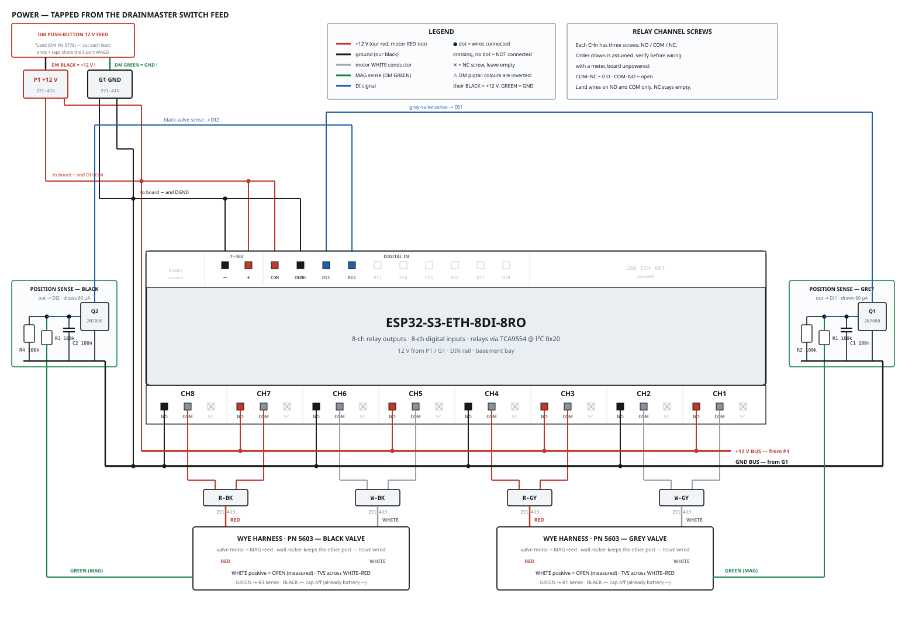
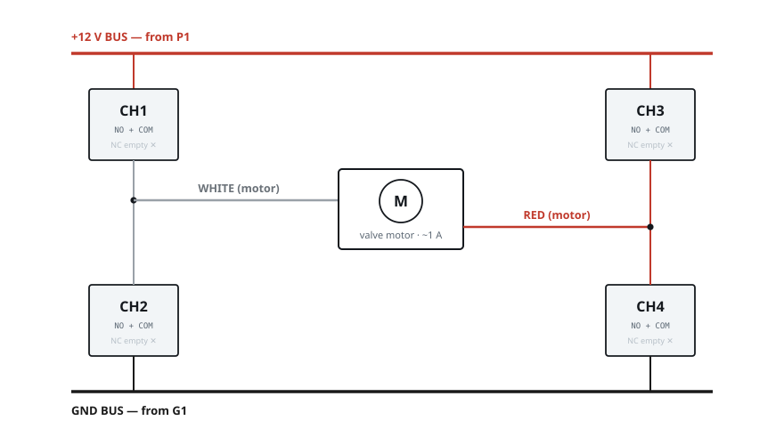

# DrainMaster dump-valve control

Panel-commanded grey and black waste valves, driven by a sixth node: a
Waveshare **ESP32-S3-ETH-8DI-8RO** relay board in the basement bay.

> **Status: designed and specified. Nothing built, no firmware written.**
> Wiring fully measured on the coach 2026-08-30; the controller board is
> ordered. This document is the build spec — it is what an engineer needs to
> wire the thing, plus the control requirements the firmware must satisfy.
>
> Printable build sheet (same content, laid out for the shop, prints
> letter-landscape with nothing split across a page):
> <https://claude.ai/code/artifact/01894ed7-d3c0-406d-a280-95fa14862e6f>

See also: [SYSTEM.md](SYSTEM.md) for where this node sits in the coach,
[FLASHING.md](FLASHING.md#valve-node) for the flash procedure, and
[../CLAUDE.md](../CLAUDE.md) for project-wide conventions.

## Wiring diagram



Every connection on one drawing, using the board's own terminal names
(`CH1`–`CH8`, `COM`/`DGND`/`DI1`–`DI8`). A filled dot means wires connect; a
plain crossing does not. Source of truth for §5–§7 below — if a table and
this diagram ever disagree, trust the diagram and fix the table.

---

## 1. Scope

| | |
|---|---|
| **Valves** | 2 × DrainMaster Premium, PN 5197 (grey + black) |
| **Controller** | Waveshare `ESP32-S3-ETH-8DI-8RO`, non-PoE |
| **Location** | Basement bay, DIN rail |
| **Power** | Spliced from the DrainMaster push-button 12 V feed (WAGO P1/G1) into the board's 7–36 V screw terminal |
| **Comms** | ESP-NOW only. No BLE, no CAN, no Ethernet. |
| **Existing wall rockers** | Stay wired and fully functional |

**Nothing about the basement BLE proxy changes.** It keeps its five BLE links
and its telemetry broadcasts; this is a separate board on the same ESP-NOW
channel.

---

## 2. Measured valve behaviour

Probed on the coach 2026-08-30. These are measurements, not datasheet values,
and several contradict the harness labels.

| Fact | Consequence |
|---|---|
| **Motor wires float at rest** — open to both rails with the rocker idle | This is what lets our relays sit in parallel with the wall switch. Everything else depends on it. |
| **WHITE positive = OPEN** (+12 V on OPEN, −12 V on CLOSE, probed red-on-WHITE) | ⚠️ **Opposite to the harness labels**, which read `+ Red (Motor)` / `− White (Motor)`. Those are wire *names*, not polarity. |
| `Black (Switch)` is 0 Ω to battery negative | The MAG pair is a single-ended 12 V signal, not a floating pair |
| Travel just under 1 s, draw ≈ 1 A | 1.0 s nominal drive |
| MAG reed is **NC and senses FULLY CLOSED** | Magnet present (closed) holds contacts apart → 12 V across the pair, LED dark. Not closed → 0 V, LED lit. |
| Reed flips **early** in the open stroke | Leaving closed ≠ fully open. Open cannot be closed-loop. |
| **Nothing has an end-of-travel cutout** | The wall switch stops because a person lets go. DM73: *"do NOT exceed 1 to 2 seconds at most."* |

⚠️ The **black valve's motor polarity has not been probed** — only grey.
Harnesses were confirmed identical, but confirm polarity before first
power-up.

### Pigtail conductors

From a spare port on the Wye harness (PN 5603), using a pigtail cut from a DM
extension cable (PN 5218). Nothing original is cut.

| Conductor | DM label | Function | Lands on |
|---|---|---|---|
| **WHITE** | `− White (Motor)` | Motor — **positive to open** | WAGO `W-GY` → `CH1·COM`, `CH2·COM` |
| **RED** | `+ Red (Motor)` | Motor — negative to open | WAGO `R-GY` → `CH3·COM`, `CH4·COM` |
| **GREEN** | `Red (Switch)` | MAG signal, 12 V ↔ 0 V | `R1`, sense divider |
| **BLACK** | `Black (Switch)` | MAG return — already battery − | Not used, cap off |

⚠️ **DrainMaster's battery pigtail uses BLACK for +12 V and GREEN for
ground** — inverted from automotive convention, on the same module being
worked around. Everything *we* add uses RED = +12 V, BLACK = ground. Label
both ends of every wire.

---

## 3. Relay map

Four relays per valve, wired as an H-bridge. **All eight channels are
consumed.**

The board labels its relays **`CH1`–`CH8`** on the enclosure — not K1–K8.
Each channel has **three screws: `NO`, `COM`, `NC`**. We use `NO` and `COM`
only. Confirm the physical screw order against the silkscreen symbol printed
above each channel, or with a meter on the unpowered board:
`COM`–`NC` reads 0 Ω, `COM`–`NO` reads open.

⚠️ **NC contacts are left unwired on all eight relays.** A Form-C relay's NC
is connected at rest, so using it would park a motor wire at ground — and the
moment someone pressed the wall rocker, their +12 V would meet our ground.
Unwired NC is what makes the rest state a genuine float.

| Relay | EXIO | Valve | COM → | NO → |
|---|---|---|---|---|
| `CH1` | 1 | grey | motor WHITE | +12 V bus |
| `CH2` | 2 | grey | motor WHITE | ground bus |
| `CH3` | 3 | grey | motor RED | +12 V bus |
| `CH4` | 4 | grey | motor RED | ground bus |
| `CH5` | 5 | black | motor WHITE | +12 V bus |
| `CH6` | 6 | black | motor WHITE | ground bus |
| `CH7` | 7 | black | motor RED | +12 V bus |
| `CH8` | 8 | black | motor RED | ground bus |



Grey valve on `CH1`–`CH4`; black valve is identical on `CH5`–`CH8`. With
every relay released, both motor wires are open to everything — the same
rest state the wall rocker leaves behind.

### Drive table (grey; black identical on CH5–CH8)

| Action | CH1 | CH2 | CH3 | CH4 | WHITE | RED | Result |
|---|---|---|---|---|---|---|---|
| **Rest** | off | off | off | off | float | float | Wall rocker works normally |
| **Open** | ON | off | off | ON | +12 V | ground | Valve drives open |
| **Close** | off | ON | ON | off | ground | +12 V | Valve drives closed |
| ⛔ | ON | ON | — | — | both rails | | **Dead short** |
| ⛔ | — | — | ON | ON | | both rails | **Dead short** |

The forbidden combinations are prevented in firmware — see
[§7](#7-control-requirements). This is the one safety property the previous
two-DPDT design got for free and this one does not.

---

## 4. Position sense

Built twice — one per valve, on `DI 1` (grey) and `DI 2` (black).

```
DM GREEN (MAG) ──[ R1 100k ]──┬──[ R2 100k ]── GND bus
                              ├──[ C1 100nF ]── GND bus
                              │
                              └── gate, Q1 (2N7000)
                                    drain ── DI n
                                    source ── GND bus

DI COM ── +12 V (WAGO P1)
```

- Divider gives **6.0 V at the gate at 12 V**, drawing **60 µA**. At 14.8 V
  charging the gate sees 7.4 V — well under the 20 V limit, and far above a
  2N7000's 3 V worst-case threshold.
- `Q1` **sinks** the digital input; `DI COM` sits at +12 V. The opto's current
  therefore comes from *our* supply.
- **DI high = valve fully closed.** DI low = not fully closed (open, or in
  transit).

⚠️ **Do not wire the reed pair directly to a digital input.** The board's DI
channels are opto-isolated and want a few milliamps; that current flows
through DrainMaster's own indicator LED and lights it whenever the valve is
closed and it should be dark. The 60 µA divider is three orders of magnitude
below the LED's operating current.

### 2N3904 substitution (bench, 2026-09-04)

**Built with a 2N3904 NPN BJT instead of the 2N7000 MOSFET** — no 2N7000 on
hand. A small-signal NPN works in this same divider circuit: the existing
100 kΩ/100 kΩ divider (Thevenin ≈ 50 kΩ, ≈6 V open-circuit) supplies roughly
106 µA of base current once the junction turns on, which is comfortably
enough for any of these parts (hFE well over 50) to saturate and sink the
DI input hard. No resistor values changed.

Two things a MOSFET swap doesn't have to think about, that a BJT swap does:

- **Leg order is different and not standardized across parts.** Map by
  function, not position: Gate→Base, Drain→Collector, Source→Emitter. A
  2N3904/2N2222/BC337/S8050 in TO-92 is E-B-C left-to-right with the flat
  (printed) face toward you; a 2SC1815 is **E-C-B** — a different order on
  an otherwise similar-looking part. Verify against the actual datasheet
  before landing it, not against this note.
- **Polarity matters.** Only an NPN belongs here (2N3904, 2N2222, BC337,
  S8050, 2SC1815). A PNP (2N2907, 2N3906) is the wrong device for this
  low-side sink role.
- **Slightly more divider current than the MOSFET case**, because a BJT
  base draws real current where a FET gate draws none: the base clamps
  near 0.7 V once conducting, versus the FET gate floating near 6 V, so the
  draw from the DrainMaster GREEN sense wire is roughly 110–150 µA instead
  of 60 µA. Still about two orders of magnitude below what would light the
  factory indicator LED, so the "don't wire the reed pair directly" warning
  above still holds and the swap is still safe.

Pinout and full point-to-point wiring (no bus bar or breadboard on the
bench — built as two twisted/soldered/heat-shrunk splices instead of a
rail):


### Digital-input terminal block

Confirmed from the enclosure legend: the DI block carries **`COM`**, **`DGND`**
and **`DI1`–`DI8`**.

| Terminal | Wiring | Why |
|---|---|---|
| `COM` | → WAGO `P1` (+12 V) | Shared by all 8 channels. Puts the inputs in sinking (NPN) mode, so each FET pulls its own channel down independently. |
| `DGND` | → GND bus | Isolated digital ground, bonded to our logic ground so the FET gate reference is valid. |
| `DI1` | ← `Q1` drain | Grey valve |
| `DI2` | ← `Q2` drain | Black valve |
| `DI3`–`DI8` | unused | |

⚠️ Tying `COM` to +12 V and `DGND` to our ground bonds the DI input side to the
coach 12 V system, giving up channel isolation on DI 1 and DI 2. Acceptable —
it is one battery ground — and the optocoupler still keeps the field side off
the MCU. Recorded as a deliberate choice.

**Verify on the bench:** with the valve closed, look at the wall switch LED in
a dark bay. Any glow means the divider is loading the LED circuit — step up to
470 kΩ / 470 kΩ (13 µA), same 6 V. Then run DM73's own test: hold a household
magnet against the white sensor on the back of the valve and watch the input
flip without moving anything.

---

## 5. Power distribution

**The board takes its 12 V from the same two 5-port WAGOs (221-415) that carry
the DrainMaster push-button's own power leads** — decided 2026-08-31. Cut each
lead of that feed and land both cut ends in the WAGO, leaving three spare
ports per block:

```
DM push-button +12 V lead (their BLACK!) ── P1 ─┬── on to the push-button
                                                ├── board 7~36V +
                                                ├── DI COM  (+12 V, all 8 ch)
                                                └── +12 V bus → CH1 CH3 CH5 CH7 · NO

DM push-button GND lead (their GREEN!) ──── G1 ─┬── on to the push-button
                                                ├── board 7~36V −
                                                ├── DGND
                                                └── GND bus → CH2 CH4 CH6 CH8 · NO
                                                              + both sense grounds
```

- That feed is already fused with **DrainMaster's inline fuse (PN 5778)**.
  Confirm it is present and rated 5 A at the tap point; if the tap point turns
  out unfused, add a 5 A inline fuse upstream of `P1`.
- Run the splice leads **short and thick (16 AWG)**: about an amp of motor
  current returns through the GND bus, and a long thin ground shows up as a
  brownout reset on every valve cycle — a fault that looks exactly like a
  firmware bug and is not one.
- The buses along the relay strip are daisy-chained 16 AWG between the `NO`
  screws, not four separate home runs.

## 6. Complete wire list

Grey valve shown in full. Black is identical with these substitutions:
`CH1→CH5 · CH2→CH6 · CH3→CH7 · CH4→CH8 · Q1→Q2 · R1→R3 · R2→R4 · C1→C2 · DI 1→DI 2 ·
W-GY→W-BK · R-GY→R-BK`.

### Power

| From | To | Wire | Gauge |
|---|---|---|---|
| DM push-button +12 V lead (their BLACK ⚠) | cut — both ends into WAGO `P1` | splice | — |
| DM push-button ground lead (their GREEN ⚠) | cut — both ends into WAGO `G1` | splice | — |
| WAGO `P1` | Board `7~36V +` | red | 18 AWG |
| WAGO `P1` | Board `DI COM` | red | 22 AWG |
| WAGO `P1` | +12 V bus → `CH1 CH3 CH5 CH7 · NO` (daisy-chain) | red | 16 AWG |
| WAGO `G1` | Board `7~36V −` | black | 18 AWG |
| WAGO `G1` | Board `DGND` | black | 22 AWG |
| WAGO `G1` | GND bus → `CH2 CH4 CH6 CH8 · NO` (daisy-chain) + both sense grounds | black | 16 AWG |

### Grey valve — motor drive

| From | To | Wire | Note |
|---|---|---|---|
| +12 V bus | `CH1 · NO` | red | 16 AWG |
| +12 V bus | `CH3 · NO` | red | 16 AWG |
| GND bus | `CH2 · NO` | black | 16 AWG |
| GND bus | `CH4 · NO` | black | 16 AWG |
| `CH1 · COM` | WAGO `W-GY` | white | 16 AWG |
| `CH2 · COM` | WAGO `W-GY` | white | 16 AWG |
| WAGO `W-GY` | Pigtail **WHITE** | white | 221-413 |
| `CH3 · COM` | WAGO `R-GY` | red | 16 AWG |
| `CH4 · COM` | WAGO `R-GY` | red | 16 AWG |
| WAGO `R-GY` | Pigtail **RED** | red | 221-413 |

⛔ `CH1·NC`, `CH2·NC`, `CH3·NC`, `CH4·NC` — **leave empty. Do not land anything.**

### Grey valve — position sense

| From | To | Wire | Note |
|---|---|---|---|
| Pigtail **GREEN** | `R1` (100 kΩ) leg A | green | 22 AWG |
| `R1` leg B | `R2` leg A · `C1` · `Q1` gate | blue | divider tap, 6.0 V |
| `R2` (100 kΩ) leg B | GND bus | black | 22 AWG |
| `C1` (100 nF) leg B | GND bus | black | parallel with R2 |
| `Q1` source | GND bus | black | 22 AWG |
| `Q1` drain | Board `DI 1` | blue | 22 AWG |
| Pigtail **BLACK** | not used, cap off | black | already at battery − |

---

## 7. Control requirements

### Board access

| Function | Access |
|---|---|
| Relays 1–8 | **TCA9554PWR, I²C `0x20`, EXIO1–8** — not direct GPIO |
| I²C bus | `GPIO41` SCL / `GPIO42` SDA (shared with the PCF85063ATL RTC) |
| Digital inputs 1–8 | `GPIO4` … `GPIO11` (DI1 = GPIO4, DI2 = GPIO5) |
| Status RGB LED | `GPIO38` (WS2812) |
| Buzzer | present; pin not published in the vendor wiki — confirm in the demo |

**Enclosure terminal names** (what is actually silkscreened, top strip left to
right): `RS485` · `7~36V` (`−` `+`) · `COM` `DGND` `DI1`…`DI8` · `USB` · `ETH`
· `ANT`. Bottom strip: `CH1`…`CH8`, three screws each. Only `7~36V`, the DI
block and `CH1`–`CH8` are used; RS485, Ethernet and USB stay empty.

### Rule 1 — one choke point with an interlock

Every relay change goes through one function that builds the whole 8-bit mask
and refuses forbidden combinations. Nothing else may touch the expander.

```c
/* Bit n = relay n+1.  Grey = CH1..CH4, black = CH5..CH8. */
#define GY_W_HI  0x01u   /* CH1: white to +12 */
#define GY_W_LO  0x02u   /* CH2: white to gnd */
#define GY_R_HI  0x04u   /* CH3: red   to +12 */
#define GY_R_LO  0x08u   /* CH4: red   to gnd */
#define BK_W_HI  0x10u
#define BK_W_LO  0x20u
#define BK_R_HI  0x40u
#define BK_R_LO  0x80u

/* A wire tied to both rails is a dead short across the house battery. */
static bool mask_is_safe(uint8_t m)
{
    if ((m & (GY_W_HI | GY_W_LO)) == (GY_W_HI | GY_W_LO)) return false;
    if ((m & (GY_R_HI | GY_R_LO)) == (GY_R_HI | GY_R_LO)) return false;
    if ((m & (BK_W_HI | BK_W_LO)) == (BK_W_HI | BK_W_LO)) return false;
    if ((m & (BK_R_HI | BK_R_LO)) == (BK_R_HI | BK_R_LO)) return false;
    return true;
}

static esp_err_t relays_apply(uint8_t m)
{
    if (!mask_is_safe(m)) {          /* never "clamp" -- refuse and shout */
        ESP_LOGE(TAG, "interlock: refused mask 0x%02x", m);
        tca9554_write(0x00);
        return ESP_ERR_INVALID_ARG;
    }
    return tca9554_write(m);
}
```

### Rule 2 — break before make

Relay contacts take 5–10 ms to move. Always drop to `0x00`, wait 50 ms, then
energise the new pair. Never transition directly between OPEN and CLOSE.

### Rule 3 — a 2 s ceiling that cannot be talked out of

⚠️ Drive 1.0 s nominal, backed by an **independent 2.0 s hardware-timer
watchdog** that calls `relays_apply(0x00)` regardless of what the state
machine believes. It must **not** be a `vTaskDelay` inside the drive routine —
if that task blocks, the motor stays energised.

### Timing

| Parameter | Value | Source |
|---|---|---|
| Nominal drive | 1000 ms | Measured travel, "just under 1 second" |
| Hard ceiling (watchdog) | 2000 ms | DM73 published limit |
| Break-before-make dead time | 50 ms | Relay pickup/dropout margin |
| Sense debounce | 50 ms | C1 gives ~5 ms; the rest in software |
| Re-drive lockout after a cycle | 3000 ms | Stops command spam stalling the motor |

### Close is verified, open is not

- **CLOSE** — drive, confirm DI goes high within the ceiling. If it does not:
  stop, flag a fault, report to the panel. **Do not retry automatically.**
- **OPEN** — DI going low confirms the valve *left* closed, which is real
  evidence the motor ran, but does not prove full travel. Drive the full
  nominal time and report `OPEN (timed)`, never `OPEN (confirmed)`.
- **Startup** — read both inputs before any drive and adopt that as the
  initial state. Never assume closed.

---

## 8. Panel side

Replaces the inert `PANEL_BTN_LOCAL_TOGGLE` placeholders on the tank screens
(`mid_coach` screen 2, `main_cabinet` TANKS).

- **Arm-then-fire on OPEN only.** First tap changes the button to
  `TAP AGAIN TO OPEN` and starts a 5 s window; a second tap inside that window
  sends the command. CLOSE stays a single tap.
- **Red background while open**, driven by *sensed* state, not by what was
  last commanded.
- **Three visual states, not two** — closed, open, unknown/fault.
- **Stale telemetry reads as unknown**, same ageing contract the shore and
  solar readouts use.

### ⚠️ The real cost is ESP-NOW, not valve logic

| Constraint | Consequence |
|---|---|
| `espnow_frame_t` is pinned at **16 bytes** by a `_Static_assert` | Growing the command union makes an updated panel's commands invisible to a panel still on the old build, silently. A valve command must be designed inside that. |
| Link layer v1 allows **one fixed unicast peer per node** | A valve node is a *second* peer — a genuine `espnow_link` change. |
| `main_cabinet` runs the **TELEMETRY role — no unicast peer at all** | And its TANKS section is where the buttons live. |
| Broadcast is unencrypted | Not available: these frames actuate real loads. |

---

## 9. Parts

### Controller

- Waveshare **`ESP32-S3-ETH-8DI-8RO`** (non-PoE) — ordered

⚠️ **Not the `-8DO` variant.** "8DO" is eight *transistor sinks*, 500 mA, not
relays — it cannot drive the valve motor. The two boards look identical in
listing photos; only the part number distinguishes them.

### To buy

| Qty | Part |
|---|---|
| 2 | DrainMaster Wye harness **PN 5603** |
| 2 | DM extension cable **PN 5218** (cut in half for pigtails) |
| 2 | **2N7000** MOSFET (or BSS138) |
| 4 | **100 kΩ** ¼ W resistor |
| 2 | **100 nF** ceramic capacitor |
| 1 | **5 A** inline fuse — only if the DM tap point turns out unfused |
| 2 | **WAGO 221-415** (5-port) — P1, G1 splices |
| 4 | **WAGO 221-413** (3-port) — W-GY, R-GY, W-BK, R-BK |
| 2 | Bidirectional TVS, e.g. **SMAJ26CA** — recommended |
| — | 16 AWG red/black, 22 AWG blue/green, DIN rail, small perfboard |

**Arc suppression:** the motor is inductive and the contacts break ~1 A DC with
the polarity reversing. A bidirectional TVS across each motor pair clamps both
polarities and survives 14.8 V charging. Not strictly required, but it is what
buys the relay contacts a long life.

**Headroom:** all 8 relays and 2 of 8 inputs are consumed. A third valve would
use the board's RS485 relay expansion rather than a second controller.

---

## 10. Bring-up order

Nothing connects to a valve until the interlock has been watched working.

1. **Bench, no valves.** Power from 12 V. Confirm the TCA9554 answers at
   `0x20` and each relay clicks individually — eight distinct clicks.
2. **Interlock test.** Deliberately call `relays_apply()` with a forbidden
   mask. Confirm it refuses, logs, and drops to `0x00`. **If this does not
   work, stop here.**
3. **Watchdog test.** Start a drive and block the state-machine task. The
   watchdog must still release the relays inside 2 s. *This is the test that
   matters most.*
4. **Meter across the COM terminals**, still no valve connected. Command OPEN
   and CLOSE; confirm polarity reverses and rest is open-circuit on both wires.
5. **Sense front-end alone.** Connect only the GREEN/BLACK pigtail pair.
   Confirm DI follows the magnet test and the wall LED stays dark when closed.
6. **Grey valve, motor connected, finger on the fuse.** One OPEN, one CLOSE.
7. **Wall rocker still works** — with our board powered, and with it unpowered.
8. **Black valve**, after confirming its motor polarity matches grey.
9. **ESP-NOW last.** Everything above is provable without a panel in the loop.

---

## 11. Open items

- [x] ~~`DI COM` terminal naming~~ — resolved from the enclosure legend:
      the DI block is `COM` / `DGND` / `DI1`–`DI8`
- [x] ~~Relay nomenclature~~ — resolved: the board says `CH1`–`CH8`
- [ ] Black valve motor polarity — probe before first power-up
- [ ] Per-channel screw order (`NO`/`COM`/`NC`) — confirm with a meter on
      arrival, then annotate this doc
- [ ] Buzzer GPIO — not in the wiki pin table, pull from the vendor demo
- [ ] ESP-NOW valve command frame — design inside the 16-byte limit
- [ ] Second unicast peer support in `espnow_link`
- [ ] `main_cabinet` role change (TELEMETRY → also a command sender)
- [ ] GitHub issue + branch, per [../CLAUDE.md](../CLAUDE.md) workflow, before
      any firmware is written

## References

- DM50-7 wiring diagrams —
  <https://www.drainmaster.com/manuals/DM50-WiringDiagramDMPremiuAndStandardValves.pdf>
  (pg 2 = this coach's 4-pin/4-pin setup; pg 3 = the Wye harness)
- DM73-7 troubleshooting —
  <https://drainmaster.com/manuals/DM73-TroubleshootProcDMValves.pdf>
  (pg 2 = polarity test and the 1–2 s limit; pg 3 = LED and MAG sensor)
- Waveshare wiki — <https://www.waveshare.com/wiki/ESP32-S3-ETH-8DI-8RO>
- Part numbers: valve **5197** · switch **5528** · Wye harness **5603** ·
  extension cable **5218** · replacement mag sensor **5016** · fuse **5778**
