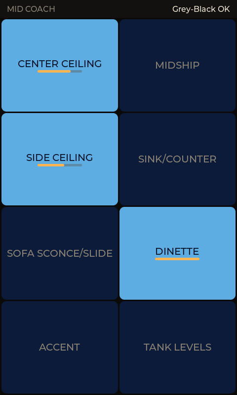
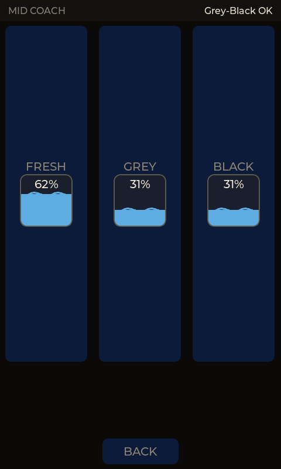
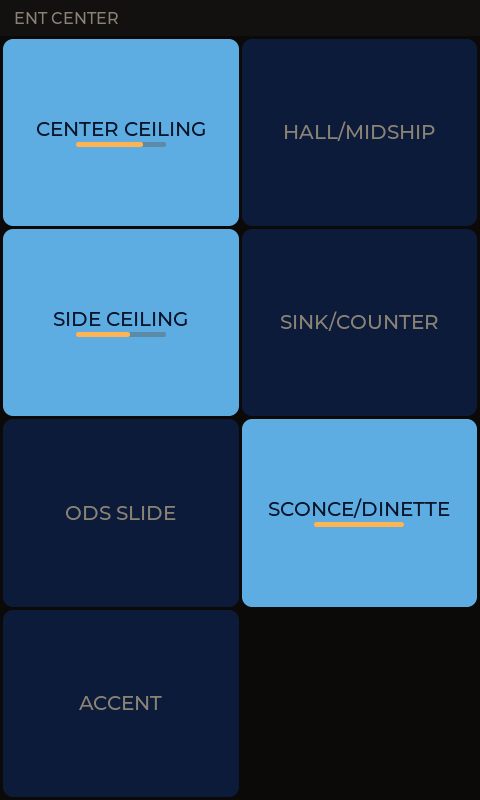
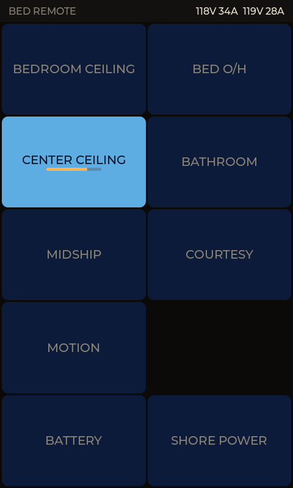
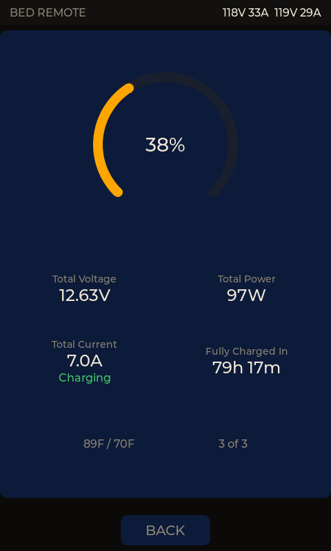
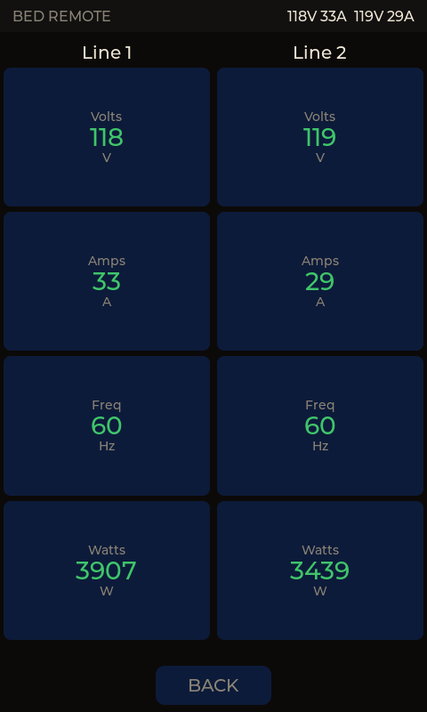
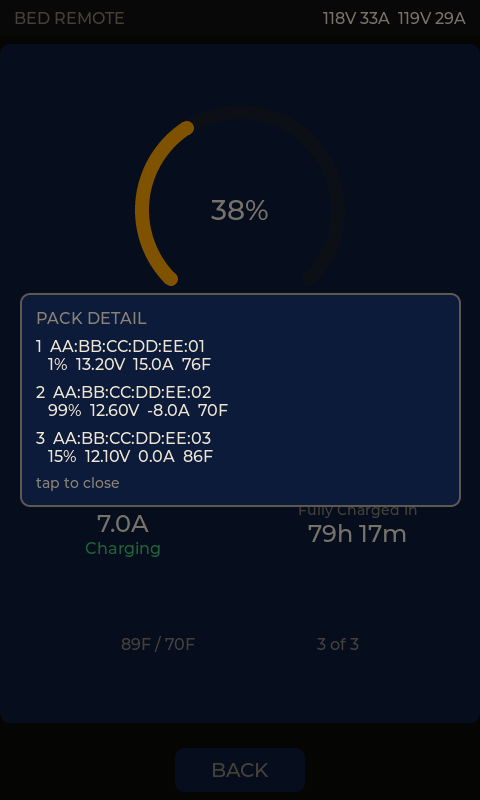

# Screen samples

Every image below is a capture from the built-in PC simulator (`sim/`),
which compiles the **real** UI sources against the same LVGL version the
firmware uses. They are not mockups.

The panels run **portrait, 480×800** — the physically-landscape 800×480 LCD
is rotated 90° in `board_4_3b.c`, and all layout code sizes itself off the
logical resolution. Captures match what the hardware shows.

Regenerate them with:

```powershell
cd sim
.\build.ps1 -Panel bedroom_remote -Shot out.bmp -Screen2
```

---

## `mid_coach` — "MID COACH"

Replaces the Entegra SW2-E8 panel. CAN-connected, and the ESP-NOW bridge for
the remote panels.

| Lights | Tank levels |
|---|---|
|  |  |

Left: the main 2×4 button grid. A lit button means a `DC_DIMMER_STATUS_3`
frame from the bus says that load is on — never that you pressed it. The
amber bar is the reported brightness level.

Right: screen 2, fed by the Garnet SeeLevel II over `TANK_STATUS`. The
status bar carries a Grey/Black summary that turns amber at 80 % and blinks
red at 89 %, where it also pins the backlight on — a "go empty the tank"
alert should not dim out of view.

---

## `ent_center` — "ENT CENTER"

Replaces the Entegra SW4-E1 panel. CAN-connected, lights only.



---

## `bedroom_remote` — "BED REMOTE"

No CAN wiring at all. Relays button presses to `mid_coach` over ESP-NOW, and
holds its own BLE links to the three battery packs. Three screens.

| Lights | Battery bank | Shore power |
|---|---|---|
|  |  |  |

**Lights.** The status bar's right side shows a live shore-power summary
(volts and amps per line) broadcast by the basement BLE proxy, so the
pedestal is visible without navigating anywhere.

**Battery bank.** The three Vatrer 300 Ah packs are wired in *parallel*, so
this is deliberately **one combined reading**, not three gauges — the way
the coach's own Vatrer display presents it. The SOC arc is colour-banded
(green ≥50 %, amber 20–49 %, red <20 %), and "N of M" turns amber if a pack
drops off BLE. Aggregation happens in firmware (`jbd_bms_combine()`); there
is no bank-level reading to fetch from a BMS.

**Shore power.** Line 1 / Line 2 volts, amps, frequency and watts, laid out
like the Hughes Autoformers phone app. Data arrives as an ESP-NOW broadcast
from the basement proxy — this panel has no BLE link to the Watchdog and
needs none. A 30 A pedestal reports one line, and the Line 2 column is
hidden rather than shown as zeroes.

### Pack detail

Tapping the battery bank readout opens a per-pack popup — MAC, SOC, volts,
amps and temperature for each slot, with offline packs called out in red.
This is the tool for telling which physical battery is which during bench
troubleshooting.



---

## Notes on what you're seeing

- **Simulated values.** `sim/sim_stubs.c` drives synthetic tank, battery and
  shore-power data so every state is reachable without hardware, including
  a pack dropping offline and a tank reaching its blink threshold.
- **Dark theme throughout.** These are wall panels in a coach, frequently
  read at night. Idle dims to 20 % at 120 s and turns the backlight fully
  off at 300 s, at which point any secondary screen also returns to the
  lights grid.
