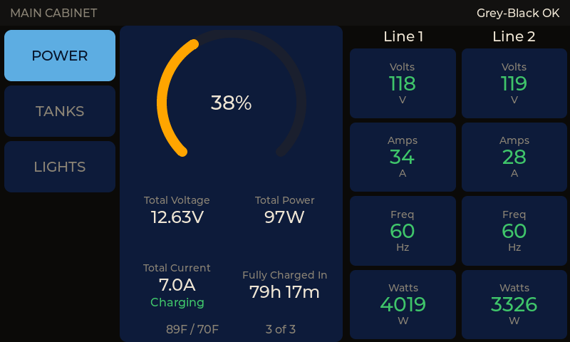
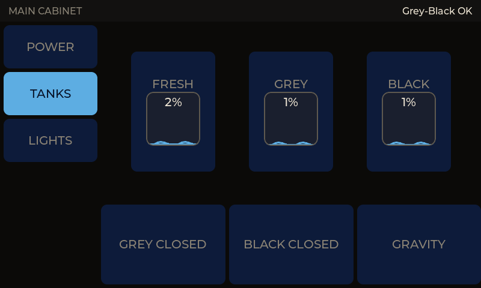
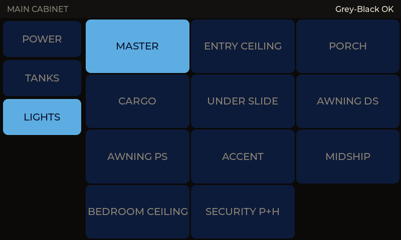

# Screen samples

Every image below is a capture from the built-in PC simulator (`sim/`),
which compiles the **real** UI sources against the same LVGL version the
firmware uses. They are not mockups.

Most panels run **portrait, 480×800** — their physically-landscape
800×480 LCD is rotated 90° in `board_4_3b.c`. `main_cabinet` is the
exception: its 7" panel runs unrotated, so it is **landscape, 800×480**.
Either way the layout code sizes itself off the LOGICAL resolution and the
simulator matches it, so captures show what the hardware shows.

Regenerate them with:

```powershell
cd sim
.\build.ps1 -Panel bedroom_remote -Shot out.bmp -Screen2
.\build.ps1 -Panel main_cabinet -Shot out.bmp -Section LIGHTS
```

`-Section` taps a section button by name before the capture, which is how a
side-nav panel's sections are reached. It takes a comma-separated sequence
(`-Section "TANKS,GREY CLOSED"`) to reach a control *inside* a section —
a hidden widget can't be hit-tested, so the section has to be opened first.

---

## `mid_coach` — "MID COACH"

Replaces the Entegra SW2-E8 panel. CAN-connected, and the ESP-NOW bridge for
the remote panels.

| Lights | Tank levels |
|---|---|
|  |  |

Left: the main 2×4 button grid. A lit button means a `DC_DIMMER_STATUS_3`
frame from the bus says that load is on — never that you pressed it. The
amber bar is the reported brightness level.

Right: screen 2, fed by the Garnet SeeLevel II over `TANK_STATUS`. The
status bar carries a Grey/Black summary that turns amber at 80 % and blinks
red at 89 %, where it also pins the backlight on — a "go empty the tank"
alert should not dim out of view.

---

## `ent_center` — "ENT CENTER"

Replaces the Entegra SW4-E1 panel. CAN-connected, lights only.


---

## `bedroom_remote` — "BED REMOTE"

No CAN wiring and no BLE. Relays button presses to `mid_coach` over ESP-NOW;
everything else on this panel — battery bank, shore power — arrives as
ESP-NOW broadcasts from the basement proxy, which holds those BLE links.
Three screens.

| Lights | Battery bank | Shore power |
|---|---|---|
|  |  |  |

**Lights.** The status bar's right side shows a live shore-power summary
(volts and amps per line) broadcast by the basement BLE proxy, so the
pedestal is visible without navigating anywhere.

**Battery bank.** The three Vatrer 300 Ah packs are wired in *parallel*, so
this is deliberately **one combined reading**, not three gauges — the way
the coach's own Vatrer display presents it. The SOC arc is colour-banded
(green ≥50 %, amber 20–49 %, red <20 %), and "N of M" turns amber if a pack
drops off. Aggregation happens on the panel (`jbd_bms_combine()`) from
per-pack broadcasts, not on the proxy — there is no bank-level reading to
fetch from a BMS, and keeping the combining in one host-tested place is what
lets the per-pack detail popup stay honest.

**Shore power.** Line 1 / Line 2 volts, amps, frequency and watts, laid out
like the Hughes Autoformers phone app. Data arrives as an ESP-NOW broadcast
from the basement proxy — this panel has no BLE link to the Watchdog and
needs none. A 30 A pedestal reports one line, and the Line 2 column is
hidden rather than shown as zeroes.

### Pack detail

Tapping the battery bank readout opens a per-pack popup — MAC, SOC, volts,
amps and temperature for each slot, with offline packs called out in red.
This is the tool for telling which physical battery is which during bench
troubleshooting. The MACs shown are the panel's own Kconfig labels — the
real links live on the proxy — so set them to match if you want the rows
named; unset slots simply read `--` while still showing live values.


---

## `main_cabinet` — "MAIN CABINET"

The 7" panel, and the only one in **landscape**. A persistent left rail lists
the sections and the selected one fills the rest of the screen, instead of
the whole-screen swap the 4.3B panels use. It boots into POWER.

Hardwired to the RV-C bus, and additionally listens to the ESP-NOW broadcast
channel — the battery packs and the Power Watchdog are on BLE links held by
the basement proxy, which no amount of CAN wiring reaches.

### Power (the default section)

Battery bank and shore power side by side: everything you'd want to know
about the coach's electrical state without touching anything.



### Tanks

The three SeeLevel gauges, plus three controls that are **deliberately
inert**: they flip their caption and drive nothing. The dump valves and the
gravity/macerator selector aren't wired yet; the control surface is here so
the layout is settled when they are.



### Lights

A three-column grid — the extra width over a portrait panel pays for a
third column. MASTER leads: it lights whenever any light is on anywhere on
the bus, and switching it off sweeps every instance currently reporting on,
including lights this panel has no button for.



⚠️ MASTER's **on** direction is a declared scene (instances 24, 26, 27, 35,
13, 17 at 100 %), not a broadcast: RV-C has no all-on command, and the G6's
own LIGHT MASTER DGN has never been captured.

---

## Notes on what you're seeing

- **Simulated values.** `sim/sim_stubs.c` drives synthetic tank, battery and
  shore-power data so every state is reachable without hardware, including
  a pack dropping offline and a tank reaching its blink threshold.
- **Dark theme throughout.** These are wall panels in a coach, frequently
  read at night. Idle dims to 20 % at 120 s and turns the backlight fully
  off at 300 s, at which point any secondary screen also returns to the
  panel's home section (the lights grid, except on `main_cabinet`, which
  goes back to POWER).
- **The tank gauge is a fixed 90×90 glass** inside a larger card, so it
  looks small in a tall container. That is pre-existing on every panel, not
  specific to the 7".
