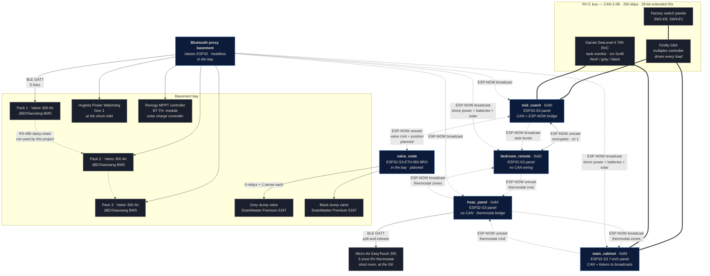

# System architecture

Every device this project talks to, and how each one is reached.

The guiding constraint: **there is no hub and no cloud.** Panels are
independent peers on the coach's RV-C bus, and the three things that aren't on
that bus (the batteries, the shore-power monitor and the solar charge
controller) are reached over BLE by the node physically closest to them — all
three live in the basement bay, so all three are held by the proxy sitting in
that bay — then re-broadcast to everyone else.

The same principle puts the dump valves on their own node: they are wired in
the bay, not on the RV-C bus, so a relay board in the bay drives them and
takes its commands over ESP-NOW.

## Architecture

Solid lines are wired buses. Dashed lines are wireless. Double lines are the
shared RV-C CAN bus, where every node is a peer.

## Equipment

### Built by this project

| Device | Hardware | Role | Talks |
|---|---|---|---|
| **`mid_coach`** | Waveshare ESP32-S3-Touch-LCD-4.3B | Lights, tank levels, battery bank (with solar) and shore power. Also the ESP-NOW bridge and the tank-telemetry producer. | RV-C CAN, ESP-NOW (unicast + broadcast) |
| **`bedroom_remote`** | Waveshare ESP32-S3-Touch-LCD-4.3B | Lights, battery bank (with the solar readout stacked beneath it), shore power — the latter three entirely from broadcasts. **No CAN wiring, no BLE.** | ESP-NOW |
| **`main_cabinet`** | Waveshare ESP32-S3-Touch-LCD-7B (1024×600) | Climate, lights, tanks, power and solar on a side-nav rail. Landscape, larger UI variant. | RV-C CAN, ESP-NOW (broadcast + thermostat commands) |
| **`hvac_panel`** | Waveshare ESP32-S3-Touch-LCD-4.3B | 5-screen launcher: menu → Thermostat / Power / Batteries / Tanks. Holds the coach's only EasyTouch BLE link and is the **thermostat bridge**. **No CAN.** | BLE (EasyTouch), ESP-NOW (thermostat commands in, zone telemetry out) |
| **Bluetooth proxy basement** | ESP32-D0WD-V3 (classic ESP32, 4 MB, no PSRAM) | Headless. Holds every BLE link in the coach and re-broadcasts what it reads. | BLE (5 links), ESP-NOW broadcast |
| **`valve_node`** *(planned)* | Waveshare ESP32-S3-ETH-8DI-8RO | Headless. Drives the two DrainMaster dump valves and reports their position. **No BLE, no CAN, no Ethernet.** | ESP-NOW unicast |

Panel boards: ESP32-S3-WROOM-1, 16 MB flash / 8 MB octal PSRAM, GT911
capacitive touch on I²C, CH422G IO expander, onboard TJA1051 CAN
transceiver, 7–36 V input off the coach 12 V rail. The three 4.3B panels are
800×480, run rotated to portrait; `main_cabinet` is a Waveshare 7B at
1024×600, run landscape (a non-B 800×480 7" until the issue #66 swap).

⚠️ **The two board types are not pin-compatible for CAN.** The 4.3B uses
GPIO15/16; the 7" uses GPIO20/19, which on the 4.3B are RS485 — and on the
7" are shared with native USB, muxed by CH422G EXIO5 (low = USB, high = CAN).
Raising it for CAN disables that board's native USB port, so the 7" is
flashed and monitored over its UART port. A board/panel mismatch produces a
panel that boots and looks healthy with a permanently silent bus, so `BOARD`
is derived from `PANEL` in the root `CMakeLists.txt` rather than passed on
the command line.

RV-C source address is `0x80 + PANEL_INDEX`; allocations are tracked in
[`panels/REGISTRY.md`](../panels/REGISTRY.md). `bedroom_remote` holds an
index even though it never transmits on CAN — one allocation table for every
node regardless of role.

### Coach equipment we talk to

| Device | Interface | Notes |
|---|---|---|
| **Firefly Integrations G6A** | RV-C CAN | Drives every light and load. Panels send `DC_DIMMER_COMMAND_2` and listen for `DC_DIMMER_STATUS_3`. |
| **Garnet SeeLevel II 709-RVC** | RV-C CAN, source `0x48` | Broadcasts `TANK_STATUS` for 3 sensors. Read-only. |
| **Factory switch panels** | RV-C CAN | Untouched. They and our panels stay in sync because both react to the same status frames. |
| **3 × Vatrer 300 Ah LiFePO4** | BLE GATT (JBD/Xiaoxiang) | Wired **in parallel**. Each BMS is its own BLE peripheral. |
| **Hughes Power Watchdog Gen 1** | BLE GATT | Surge protector / power monitor at the shore inlet. Receive-only. |
| **Renogy MPPT charge controller** | BLE GATT (`BT-TH-` module) | Solar charge controller in the bay. Polled for PV watts/volts/amps, battery volts and SOC, charge state, and controller/battery temperature. Read-only. |
| **Micro-Air EasyTouch 355** | BLE GATT (JSON) | 3-zone RV thermostat in the stool room. `hvac_panel` holds the coach's only link to it and bridges commands from the other panels. No BLE pairing — auth is an account-password write. |
| **2 × DrainMaster Premium valves** | 12 V motor + NC magnetic reed | Grey and black dump valves, PN 5197. Driven by relay contacts wired **in parallel with the factory wall rockers**, which stay fully functional. Full wiring diagram and build spec: [DRAINMASTER-VALVES.md](DRAINMASTER-VALVES.md). |

## Memory budget

Flash is comfortable everywhere; **RAM is the constraint that actually bites**,
and it bit once already (see *LVGL heap* below).

### Flash — application image vs. partition

Panels carry a single 4 MiB `factory` app partition (there is no OTA slot —
updates are USB-only); the proxy carries 3 MiB. Figures are from the last
build of each, 2026-08-28.

| Device | App image | Partition | Used | Free |
|---|---|---|---|---|
| `main_cabinet` (7B) | 1,289,344 B (1.23 MiB) | 4 MiB | 30.7 % | 2.78 MiB |
| `main_cabinet` (non-B, pre-#66) | 1,280,352 B (1.22 MiB) | 4 MiB | 30.5 % | 2.78 MiB |
| `mid_coach` | 1,284,256 B (1.22 MiB) | 4 MiB | 30.6 % | 2.78 MiB |
| `bedroom_remote` | 1,273,472 B (1.21 MiB) | 4 MiB | 30.4 % | 2.79 MiB |
| Bluetooth proxy basement | 1,125,760 B (1.07 MiB) | 3 MiB | 35.8 % | 1.93 MiB |

The proxy is the tightest, and deliberately so: a Bluedroid + WiFi build
overruns the IDF default 1 MB app partition, which is why `proxy/` carries its
own `partitions.csv`.

### RAM — free at boot

Measured on hardware from the boot log, `main_cabinet` (**non-B 7"**) on
2026-08-28 with the 128 KiB LVGL pool in place:

All panel rows are now measured the same way — the
`heap free after display init: internal … PSRAM …` line that both
`board_4_3b.c` and `board_lcd7b.c` log right after `board_display_init()`
returns. Capturing it is step 5 of [FLASHING.md](FLASHING.md)'s
per-connection checklist, so these stay current as devices are reflashed.

| Device | Internal heap free (after display init) | RTC RAM | PSRAM free | Captured |
|---|---|---|---|---|
| `main_cabinet` (7B) | ~108 KiB (108,531 B) | 7 KiB | **~4.47 MiB (4,685,968 B)** | v1.00-era, 2026-09-07 |
| `main_cabinet` (non-B 7", at boot, retired) | 192 KiB (139 + 21 + 32) | 7 KiB | 7,054 KiB | 2026-08-28 |
| `mid_coach` (4.3B) | **131 KiB (133,843 B)** | 7 KiB | **3.22 MiB (3,371,724 B)** | **v1.00, 2026-09-07** |
| `hvac_panel` (4.3B) | **133 KiB (136,119 B)** | 7 KiB | **2.95 MiB (3,096,124 B)** | **v1.00, 2026-09-07** |
| `bedroom_remote` (4.3B) | not measured | — | 8 MiB fitted | — |
| Bluetooth proxy basement | not measured | — | **none fitted** | — |

⚠️ `hvac_panel` has the *most* internal heap free of the 4.3B panels despite
being the only one running Bluedroid — because its LVGL pool is 108 KiB
rather than 128 KiB (`panels/sdkconfig.hvac_panel.defaults`), and that
20 KiB comes straight back to the internal heap. Its PSRAM is
correspondingly the lowest, since BT and WiFi/LWIP allocate there.

The 7B row is measured on hardware (COM21, 2026-09-05) right after
`board_display_init` returns. `board_lcd7b.c` runs `avoid_tearing`, which
hands the RGB panel's two PSRAM framebuffers to LVGL as its draw buffers —
so NO separate LVGL draw buffers are allocated, and PSRAM free is ~4.75 MiB
(vs ~2.16 MiB the partial-render path would leave). Two 1024×600 RGB565
framebuffers + `SPIRAM_FETCH_INSTRUCTIONS`/`RODATA` account for the ~2.3
MiB used. Internal heap (~123 KiB free, 128 KiB LVGL pool already carved
out) is fine — do NOT enlarge the CPU caches to buy PSRAM bandwidth, it
overruns internal RAM and boot-loops on WiFi malloc failure.

⚠️ **Reading a panel's boot log needs its UART port, not its USB port.** The
console is on UART0 (GPIO43/44), which on the 4.3B is the CH343 **UART**
USB-C connector; the native USB port enumerates and flashes fine but carries
no console, so a capture there is silent and looks like a dead board. (On
`main_cabinet`, the 7", CAN is muxed onto the native USB pins anyway, so its
CH343 port is the only option.) `bedroom_remote` was flashed over its native
USB port, which is why its row is still blank. Capture the `heap_init` lines
over UART next time any board is connected.

⚠️ The proxy has **no PSRAM at all**, so its BLE + WiFi stacks and five GATTC
connections come entirely out of internal RAM. It is the node with the least
headroom for new work, despite being the one with no display.

### LVGL heap

LVGL is configured with its own fixed pool (`CONFIG_LV_USE_BUILTIN_MALLOC=y`),
carved out of internal RAM at startup, and it **cannot grow** —
`LV_MEM_POOL_EXPAND_SIZE` is 0. When it fills, LVGL's renderer spins on the
failed allocation instead of failing cleanly.

| Panel | LVGL pool | Measured peak | Headroom |
|---|---|---|---|
| `main_cabinet` (non-B 7") | 128 KiB | 87,848 B (hardware) | ~43 KiB |
| `main_cabinet` (7B, #66) | 128 KiB | ~77,500 B (simulator, `LV_STDLIB_BUILTIN` 128 KiB) — flat across 12 nav cycles, no leak | ~50 KiB |
| `mid_coach` | 128 KiB | 86,152 B | ~44 KiB |
| `bedroom_remote` | 128 KiB | 66,088 B | ~65 KiB |
| `hvac_panel` | **108 KiB** + 24 KiB expand | ~80,000 B (simulator, allocator matched) | ~28 KiB |

`mid_coach` is the clearest illustration of why this is measured rather than
assumed. Adding its battery and shore screens took it to **71,704 B** — some
6 KB past the old 64 KiB cap on its own — then the solar strip took it to
82,968 B and the tank valve controls to 86,152 B. Every one of those steps
was a few lines in a panel header.

`main_cabinet` overran the 64 KiB default: its four screens cost 78 KiB just to
build the UI and peaked at 88 KiB while rendering. It still booted — much of
the cost is incurred lazily, as each screen is first drawn — and then wedged
after about seven nav-rail taps. The failure presented as three unrelated
faults, because `esp_lvgl_port` holds its lock across all of
`lv_timer_handler()`: with the renderer stuck, the ESP-NOW receive task blocked
on that lock and the battery and shore readouts aged out to blank, while the
task watchdog reported only that `taskLVGL` was pegging CPU 1.

`CONFIG_LV_MEM_SIZE_KILOBYTES=128` in `sdkconfig.defaults` fixes it for every
panel, at a cost of 64 KiB of internal RAM each.

The 1024×600 `main_cabinet` (issue #66) does **not** need more: bigger fonts,
a larger SOC arc and a 200×300 tank glass do not add LVGL objects, and glyph
data is `const` rodata, not pool. The simulator (allocator switched to match)
measured a flat ~77.5 KiB peak over repeated section switching — slightly
under the non-B's, well inside the 128 KiB pool. Re-confirm from the hardware
boot log at bring-up.

> ⚠️ **The simulator cannot catch this class of bug by default.** `sim/lv_conf.h`
> uses `LV_STDLIB_CLIB`, an effectively unbounded allocator, so a UI that
> overflows the firmware's pool runs perfectly on the PC. To reproduce one,
> temporarily set the sim to `LV_STDLIB_BUILTIN` with a matching `LV_MEM_SIZE`
> and replay the steps with `--shot out.bmp "section:A,B,C,..."` — the
> comma-separated form is a tap *sequence*. Revert both files afterwards.

> ⚠️ Any panel gaining a screen or a full-width readout should have its peak
> re-measured. `bedroom_remote` overran the old cap by only ~550 bytes once
> it gained the stacked solar readout — enough to matter, small enough that
> nothing but a measurement would have caught it.

⚠️ IDF applies `sdkconfig.defaults` only when an `sdkconfig` does not already
exist, so raising the pool on an existing build dir means editing its
`sdkconfig` **in place** (regenerating wipes the real ESP-NOW peer MAC and
battery MACs). Every current panel build dir is already on 128 KiB
(`hvac_panel` on 108 KiB via `panels/sdkconfig.hvac_panel.defaults`).
It is the least exposed of the four — lights only, no secondary screens — but
its peak has never been measured.

## Communication paths

### RV-C — CAN 2.0B, 250 kbps, 29-bit extended IDs

The coach's native bus and the shared state mechanism. There is no master:
each panel transmits commands and reacts to status frames, which is what
keeps them consistent with the factory switches and the Firefly app.

| DGN | Name | Direction | Use |
|---|---|---|---|
| `0x1FEDB` | `DC_DIMMER_COMMAND_2` | TX | instance, level 0–200, command |
| `0x1FEDA` | `DC_DIMMER_STATUS_3` | RX | instance, operating level, load status |
| `0x1FFB7` | `TANK_STATUS` | RX | instance, relative level, resolution |

**Invariant:** a button's visual state is driven *only* by status frames from
the bus — never by the command you just sent.

### ESP-NOW — 2.4 GHz, channel 1

Two distinct traffic classes, deliberately kept separate.

**Encrypted unicast** carries commands and status between `bedroom_remote`
and `mid_coach`, and — once built — valve commands and position between
`mid_coach` and `valve_node`. These frames actuate real loads, so they use a
PMK plus a per-peer LMK.

**Unencrypted broadcast** carries read-only telemetry — shore power, per-pack
battery readings and the solar controller from the proxy, tank levels from the
bridge — so any panel can display data it has no connection to.

Solar is broadcast **whether or not the controller is reachable**, flagged
offline when it isn't. That follows the battery contract rather than the
shore-power one: a panel needs to distinguish "the controller dropped" from
"the whole proxy is gone", and silence cannot express the difference. It fits
the existing 16-byte telemetry envelope exactly, so adding it did **not**
change the wire format — a producer still on older firmware keeps working.

> ⚠️ Broadcast frames **cannot** be encrypted in ESP-NOW at all. That is
> acceptable only because this channel is read-only measurement. Command and
> status frames must never move onto it.

> ⚠️ Every node must be on the **same WiFi channel**. There is no AP to
> negotiate one, and a mismatch is silently invisible — exactly like a wrong
> peer MAC.

The control frame's size is part of the wire format; a `_Static_assert` pins
it, because panels are flashed one at a time and a size change would make an
updated panel's commands silently invisible to a panel still on the old
build.

### BLE — GATT central

| Link | Held by | Service | Behaviour |
|---|---|---|---|
| 3 × battery BMS | Bluetooth proxy basement | `0xFF00` | Polled every 30 s |
| Power Watchdog | basement proxy | `0xFFE0` | Streams ~1 Hz, no polling |
| Renogy MPPT | basement proxy | Modbus over BLE | Polled every 30 s. Found by name scan (`FIREFLY_SOLAR_NAME`) when its MAC is left at the placeholder |

These peripherals accept **one connection at a time**, which is why the
Watchdog gets a dedicated node rather than sharing a panel — and why your
phone app cannot connect while ours is attached.

All five BLE links are held by one node, which is why
`components/ble_host` exists: Bluedroid allows exactly one GAP callback and
one GATTC callback per node, and a second registration silently replaces the
first rather than failing.

Poll rate matters for the batteries: JBD units are widely reported to
misbehave when polled more often than ~20 s, so the Kconfig floor enforces
that rather than merely documenting it. The Watchdog has no polling command
at all and cannot be slowed down.

### RS-485 — between battery packs, not used here

The Vatrer packs daisy-chain over RS-485, and that is how a vendor display
plugged into one battery can show the whole bank. **This project is not
wired into that bus.** A JBD BLE module is a UART bridge to a single BMS and
knows nothing of its siblings, so bank aggregation happens in our firmware
(`jbd_bms_combine()`), not by asking a BMS for a total.

## Deliberate limits

- **No WiFi, no OTA, no cloud.** Updates are USB-only by design — the
  ESP32-S3 radio is WPA2-only and cannot associate to the target WPA3+PMF
  network. See [FLASHING.md](FLASHING.md).
- **The Watchdog cannot be commanded.** Gen 1 has no working relay-control
  path: the ASCII command strings are known from the vendor app, but nobody
  has recovered the wire framing, and writes are accepted at the GATT layer
  and ignored. Only Gen 2 (EPOW models) has a working `SetOpen`.
- **One remote per bridge.** ESP-NOW pairing is fixed at build time — no
  runtime pairing, no mesh. ⚠️ `valve_node` needs a **second** unicast peer,
  which is the single largest piece of work in that feature — see
  [DRAINMASTER-VALVES.md](DRAINMASTER-VALVES.md#8-panel-side).
- **Dump valves have no full-open sensor.** The DrainMaster reed senses
  *fully closed* only, so closing is closed-loop and opening is a timed run
  under a hard 2 s ceiling. Nothing in the valve has an end-of-travel cutout.
- **The MASTER button drives the real thing, but "on" depends on the G6's
  memory.** RV-C has no all-lights DGN; the coach's factory rocker was sniffed
  2026-08-28 and uses group addressing — six `DC_DIMMER_COMMAND_2` frames,
  groups `0x84`–`0x89`, instance `0xFF`, `MEMORY_OFF` for off and level 251
  ("restore remembered") for on. `main_cabinet` replays exactly those.
  ⚠️ Pressing **on without a preceding off** therefore restores whatever the
  G6 last remembered, which can be stale. The factory rocker behaves the same
  way; it is inherent to the MEMORY_OFF/restore pair, not a defect. Capture
  and decode: [instance_map.yaml](instance_map.yaml) → `light_master`.
