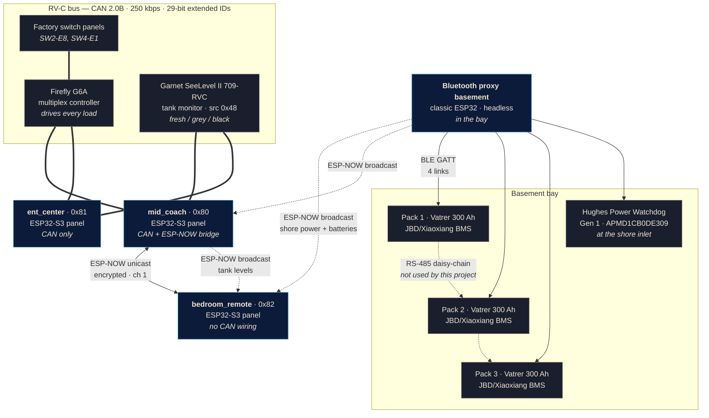

# System architecture

Every device this project talks to, and how each one is reached.

The guiding constraint: **there is no hub and no cloud.** Panels are
independent peers on the coach's RV-C bus, and the two things that aren't on
that bus (the batteries and the shore-power monitor) are reached over BLE by
the node physically closest to them — both live in the basement bay, so both
are held by the proxy sitting in that bay — then re-broadcast to everyone
else.

## Architecture

Solid lines are wired buses. Dashed lines are wireless. Double lines are the
shared RV-C CAN bus, where every node is a peer.

## Equipment

### Built by this project

| Device | Hardware | Role | Talks |
|---|---|---|---|
| **`mid_coach`** | Waveshare ESP32-S3-Touch-LCD-4.3B | Lights + tank levels. Also the ESP-NOW bridge and the tank-telemetry producer. | RV-C CAN, ESP-NOW (unicast + broadcast) |
| **`ent_center`** | Waveshare ESP32-S3-Touch-LCD-4.3B | Lights only | RV-C CAN |
| **`bedroom_remote`** | Waveshare ESP32-S3-Touch-LCD-4.3B | Lights, battery bank, shore power — the latter two entirely from broadcasts. **No CAN wiring, no BLE.** | ESP-NOW |
| **Bluetooth proxy basement** | ESP32-D0WD-V3 (classic ESP32, 4 MB, no PSRAM) | Headless. Holds every BLE link in the coach and re-broadcasts what it reads. | BLE (4 links), ESP-NOW broadcast |

Panel boards: ESP32-S3-WROOM-1-N16R8 (16 MB flash, 8 MB octal PSRAM), 4.3"
800×480 RGB LCD run rotated to portrait, GT911 capacitive touch on I²C,
CH422G IO expander, onboard TJA1051 CAN transceiver, 7–36 V input off the
coach 12 V rail.

RV-C source address is `0x80 + PANEL_INDEX`; allocations are tracked in
[`panels/REGISTRY.md`](../panels/REGISTRY.md). `bedroom_remote` holds an
index even though it never transmits on CAN — one allocation table for every
node regardless of role.

### Coach equipment we talk to

| Device | Interface | Notes |
|---|---|---|
| **Firefly Integrations G6A** | RV-C CAN | Drives every light and load. Panels send `DC_DIMMER_COMMAND_2` and listen for `DC_DIMMER_STATUS_3`. |
| **Garnet SeeLevel II 709-RVC** | RV-C CAN, source `0x48` | Broadcasts `TANK_STATUS` for 3 sensors. Read-only. |
| **Factory switch panels** | RV-C CAN | Untouched. They and our panels stay in sync because both react to the same status frames. |
| **3 × Vatrer 300 Ah LiFePO4** | BLE GATT (JBD/Xiaoxiang) | Wired **in parallel**. Each BMS is its own BLE peripheral. |
| **Hughes Power Watchdog Gen 1** | BLE GATT | Surge protector / power monitor at the shore inlet. Receive-only. |

## Communication paths

### RV-C — CAN 2.0B, 250 kbps, 29-bit extended IDs

The coach's native bus and the shared state mechanism. There is no master:
each panel transmits commands and reacts to status frames, which is what
keeps them consistent with the factory switches and the Firefly app.

| DGN | Name | Direction | Use |
|---|---|---|---|
| `0x1FEDB` | `DC_DIMMER_COMMAND_2` | TX | instance, level 0–200, command |
| `0x1FEDA` | `DC_DIMMER_STATUS_3` | RX | instance, operating level, load status |
| `0x1FFB7` | `TANK_STATUS` | RX | instance, relative level, resolution |

**Invariant:** a button's visual state is driven *only* by status frames from
the bus — never by the command you just sent.

### ESP-NOW — 2.4 GHz, channel 1

Two distinct traffic classes, deliberately kept separate.

**Encrypted unicast** carries commands and status between `bedroom_remote`
and `mid_coach`. These frames actuate real loads, so they use a PMK plus a
per-peer LMK.

**Unencrypted broadcast** carries read-only telemetry — shore power from the
proxy, tank levels from the bridge — so any panel can display data it has no
connection to.

> ⚠️ Broadcast frames **cannot** be encrypted in ESP-NOW at all. That is
> acceptable only because this channel is read-only measurement. Command and
> status frames must never move onto it.

> ⚠️ Every node must be on the **same WiFi channel**. There is no AP to
> negotiate one, and a mismatch is silently invisible — exactly like a wrong
> peer MAC.

The control frame's size is part of the wire format; a `_Static_assert` pins
it, because panels are flashed one at a time and a size change would make an
updated panel's commands silently invisible to a panel still on the old
build.

### BLE — GATT central

| Link | Held by | Service | Behaviour |
|---|---|---|---|
| 3 × battery BMS | Bluetooth proxy basement | `0xFF00` | Polled every 30 s |
| Power Watchdog | basement proxy | `0xFFE0` | Streams ~1 Hz, no polling |

Both peripherals accept **one connection at a time**, which is why the
Watchdog gets a dedicated node rather than sharing a panel — and why your
phone app cannot connect while ours is attached.

All four BLE links are held by one node, which is why
`components/ble_host` exists: Bluedroid allows exactly one GAP callback and
one GATTC callback per node, and a second registration silently replaces the
first rather than failing.

Poll rate matters for the batteries: JBD units are widely reported to
misbehave when polled more often than ~20 s, so the Kconfig floor enforces
that rather than merely documenting it. The Watchdog has no polling command
at all and cannot be slowed down.

### RS-485 — between battery packs, not used here

The Vatrer packs daisy-chain over RS-485, and that is how a vendor display
plugged into one battery can show the whole bank. **This project is not
wired into that bus.** A JBD BLE module is a UART bridge to a single BMS and
knows nothing of its siblings, so bank aggregation happens in our firmware
(`jbd_bms_combine()`), not by asking a BMS for a total.

## Deliberate limits

- **No WiFi, no OTA, no cloud.** Updates are USB-only by design — the
  ESP32-S3 radio is WPA2-only and cannot associate to the target WPA3+PMF
  network. See [FLASHING.md](FLASHING.md).
- **The Watchdog cannot be commanded.** Gen 1 has no working relay-control
  path: the ASCII command strings are known from the vendor app, but nobody
  has recovered the wire framing, and writes are accepted at the GATT layer
  and ignored. Only Gen 2 (EPOW models) has a working `SetOpen`.
- **One remote per bridge.** ESP-NOW pairing is fixed at build time — no
  runtime pairing, no mesh.
